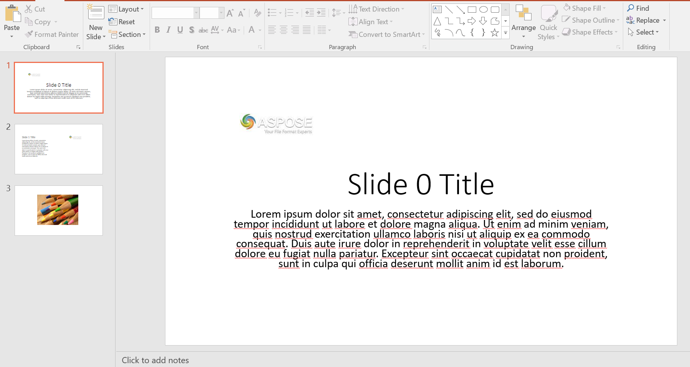

# Extract Text from Microsoft PowerPoint Presentation using JAVA SDK of GroupDocs.Parser REST API

This is GroupDocs free consulting project that helps you to extract Text from Microsoft PowerPoint Presentation PPTX/PPT using GroupDocs.Parser Cloud SDK for JAVA. 

GroupDocs.Parser Cloud API is a document data extraction REST API that supports over 50 common document types, powered by [GroupDocs.Parser on premise API](https://products.groupdocs.com/parser). You can use GroupDocs.Parser Cloud API with any language ( for example .NET, Java, PHP, Ruby, Python, Node.js and many more) or platform that supports REST to parse documents and extract data.

## Requirements

The project requires [Maven](https://maven.apache.org/) to be installed. You can import this project in any preferred Java IDE. 

If you want to use GroupDocs.Parser Cloud API in your existing project then add following repository and dependency to your project's POM.

```xml
<repository>
    <id>groupdocs-artifact-repository</id>
    <name>GroupDocs Artifact Repository</name>
    <url>https://repository.groupdocs.cloud/repo</url>
</repository>
```

```xml
<dependency>
    <groupId>com.groupdocs</groupId>
    <artifactId>groupdocs-parser-cloud</artifactId>
    <version>19.11</version>
    <scope>compile</scope>
</dependency>
```
# Project Screenshots
* Sample PPTX screenshot used in the project


* This is PPTX Text output of the REST API call
```
Slide 0 Title
Lorem ipsum dolor sit amet, consectetur adipiscing elit, sed do eiusmod tempor incididunt ut labore et dolore magna aliqua. Ut enim ad minim veniam, quis nostrud exercitation ullamco laboris nisi ut aliquip ex ea commodo consequat. Duis aute irure dolor in reprehenderit in voluptate velit esse cillum dolore eu fugiat nulla pariatur. Excepteur sint occaecat cupidatat non proident, sunt in culpa qui officia deserunt mollit anim id est laborum.
Slide 1 Title
Lorem ipsum dolor sit amet, consectetur adipiscing elit, sed do eiusmod tempor incididunt ut labore et dolore magna aliqua. Ut enim ad minim veniam, quis nostrud exercitation ullamco laboris nisi ut aliquip ex ea commodo consequat. Duis aute irure dolor in reprehenderit in voluptate velit esse cillum dolore eu fugiat nulla pariatur. Excepteur sint occaecat cupidatat non proident, sunt in culpa qui officia deserunt mollit anim id est laborum.
```

# Interested in GroupDocs free consulting project?
[If you are also interested in a free consulting project by GroupDocs team then please view details on this page](https://forum.groupdocs.com/c/free-consulting/37)

If you have any questions about GroupDocs Cloud APIs, please feel free to post your query in [GroupDocs Cloud file format APIs Forums](https://forum.groupdocs.cloud/).

Also, you can keep in touch with the latest developments in file format APIs offered by [GroupDocs Cloud at our Blog](https://blog.groupdocs.cloud/).

# This free consulting project is based on the following issue:
I want to create/build an api to parse ppt and pptx: https://github.com/groupdocs-free-consulting/projects/issues/1
